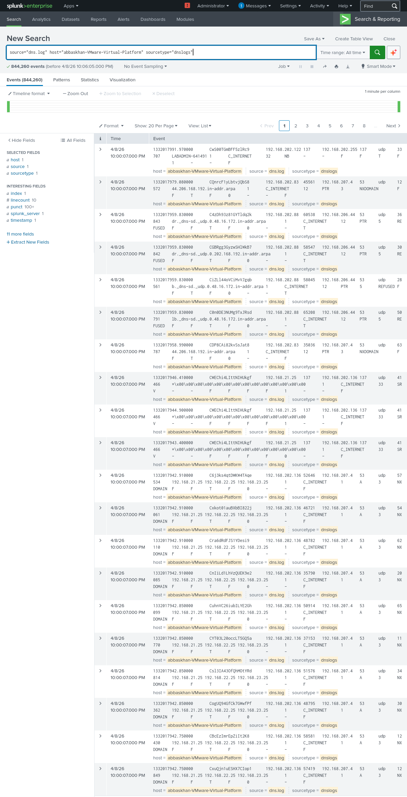

#  DNS Threat Detection using Splunk SIEM

##  Project Overview

This project demonstrates the analysis of DNS log data using Splunk SIEM to identify potential security threats and abnormal network behavior. The objective is to simulate a real-world Security Operations Center (SOC) workflow by ingesting logs, performing searches, and identifying suspicious patterns.

---
##  Screenshots

### 🔹 DNS Log Ingestion in Splunk


##  Objectives

* Understand DNS log structure and behavior
* Perform log ingestion into Splunk
* Analyze DNS queries for anomalies
* Identify suspicious domains and activities
* Simulate SOC-level investigation

---

##  Tools & Technologies

* Splunk SIEM
* Wireshark (for packet capture reference)
* VirusTotal (for domain reputation)
* AbuseIPDB (for IP reputation)

---

##  Dataset

* Public DNS dataset (MACCDC 2012)
* File used: `dns.log`

---

## Project Setup

###  Data Preparation

* Downloaded DNS dataset
* Extracted `.gz` file to obtain `dns.log`

###  Data Ingestion

* Uploaded DNS log file into Splunk
* Configured source type as: `dns_sample`
* Assigned index for analysis

### Verification

* Verified successful ingestion using search queries:

```
index=dns_lab
```

---

##  Initial Analysis

###  Observations

* DNS logs successfully ingested into Splunk
* Identified key fields such as:

  * Source IP
  * Destination IP
  * Queried domain (FQDN)
  * Query type
  * Response codes

---

##  Queries Used (Initial)

```
index=dns_lab
```

```
index=dns_lab | stats count by query
```

```
index=dns_lab | top id.orig_h
```

---

##  Key Findings


* Initial ingestion successful
* DNS traffic structure analyzed
* Ready for advanced threat detection

---

##  Project Structure

```
DNS-Splunk-Analysis/
├── README.md
├── dns.log
├── screenshots/
├── queries/
└── report/
```

---

##  Learning Outcomes

* Hands-on experience with SIEM tools
* Understanding DNS-based threat detection
* Real-world SOC investigation workflow
* Log analysis and pattern recognition

---

##  Future Work

* Detect suspicious domains (.xyz, .top, etc.)
* Identify beaconing behavior
* Analyze NXDOMAIN responses
* Integrate threat intelligence sources
* Build dashboards in Splunk

---

##  Author

**Abbas Khan**
Cybersecurity Enthusiast | SOC Analyst Learner | Malware Analysis

---

##  Notes

This project is part of a hands-on cybersecurity learning journey focused on developing practical SOC and threat detection skills.
