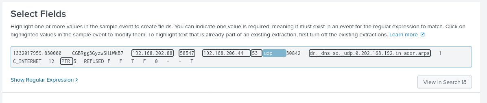
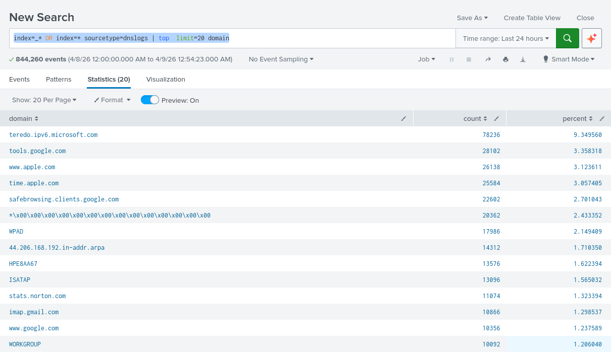
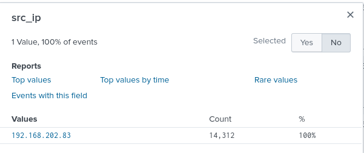
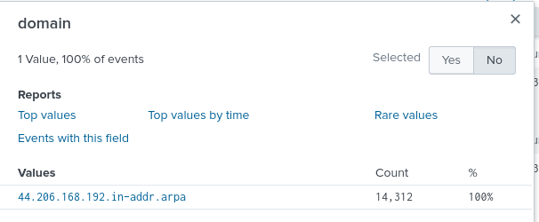
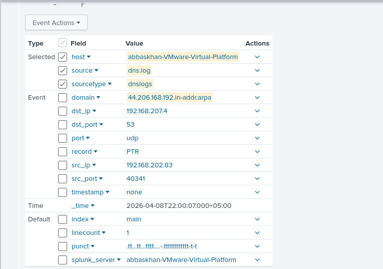

Steps to Analyze DNS Log Files in Splunk SIEM

1. Search for DNS Events

    Open Splunk interface and navigate to the search bar.
    Enter the following search query to retrieve DNS events
---

source="dns.log" host="abbaskhan-VMware-Virtual-Platform" sourcetype="dnslogs"
--

2. Extract Relevant Fields

    Identify key fields in DNS logs such as source IP, destination IP, domain name, query type, response code, etc.
    As mentioned below, | regex _raw="(?i)\b(dns|domain|query|response|port 53)\b": This regex searches for common DNS-related keywords in the raw event data.
    Extraction command:
---

| regex _raw="(?i)\b(dns|domain|query|response|port 53)\b"
--
So we Extract New filed 

## Sample DNS Log Entry (Observed Traffic)

| Field       | Value                          |
|------------|--------------------------------|
| Source IP   | 10.10.117.210                 |
| Source Port | 19198                         |
| Destination IP | 192.168.207.4             |
| Destination Port | 53 (DNS)               |
| Domain Queried | teredo.ipv6.microsoft.com |
| Record Type | A (IPv4 Address Query)        |

3. Identify Anomalies

    Look for unusual patterns or anomalies in DNS activity.
    Command query to identify spikes
---

index=_* OR index=* sourcetype=dnslogs | stats count by domain
--
or 

---

index=_* OR index=* sourcetype=dnslogs | top  limit=20 domain
--

4. Find the top DNS sources

    Use the top command to count the occurrences of each query type:
---

index=_* OR index=* sourcetype=dnslogs domain="44.206.168.192.in-addr.arpa" src_ip="192.168.202.83"
--

###  Analysis

- The domain belongs to the `in-addr.arpa` zone, used for reverse DNS lookups.
- A single host (192.168.202.83) generated all 14,312 queries.
- The traffic is fully concentrated (100%), indicating automated behavior rather than human activity.
- Such repetitive reverse DNS queries may indicate:
  - Network scanning or enumeration
  - Scripted or automated process
  - Potential compromised system performing reconnaissance

5. Investigate Suspicious Domains

    Search for domains associated with known malicious activity or suspicious behavior.
    Utilize threat intelligence feeds or reputation databases to identify malicious domains such virustotal.com
    search for known malicious domains:
---

source="dns.log" host="abbaskhan-VMware-Virtual-Platform" sourcetype="dnslogs" domain="44.206.168.192.in-addr.arpa"
--

Conclusion

Analyzing DNS log files using Splunk SIEM enables security professionals to detect and respond to potential security incidents effectively. By understanding DNS activity and identifying anomalies, organizations can enhance their overall security posture and protect against various cyber threats.
